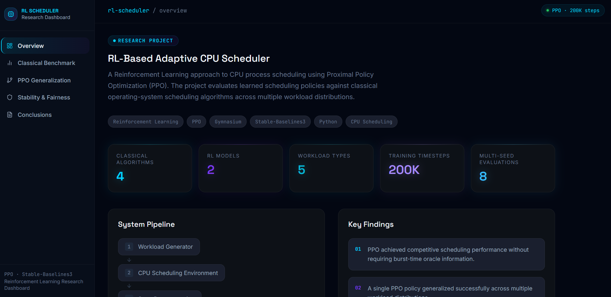
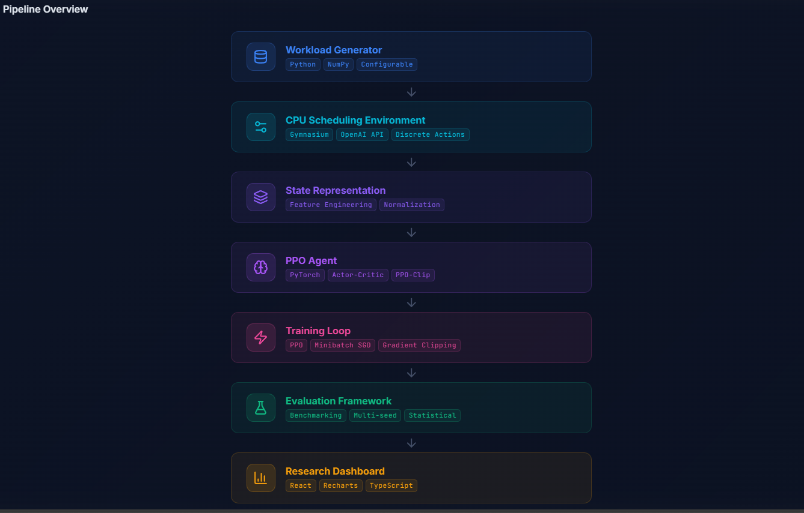
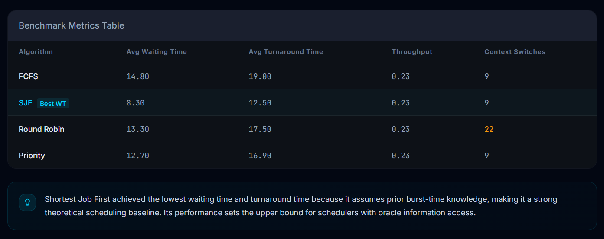
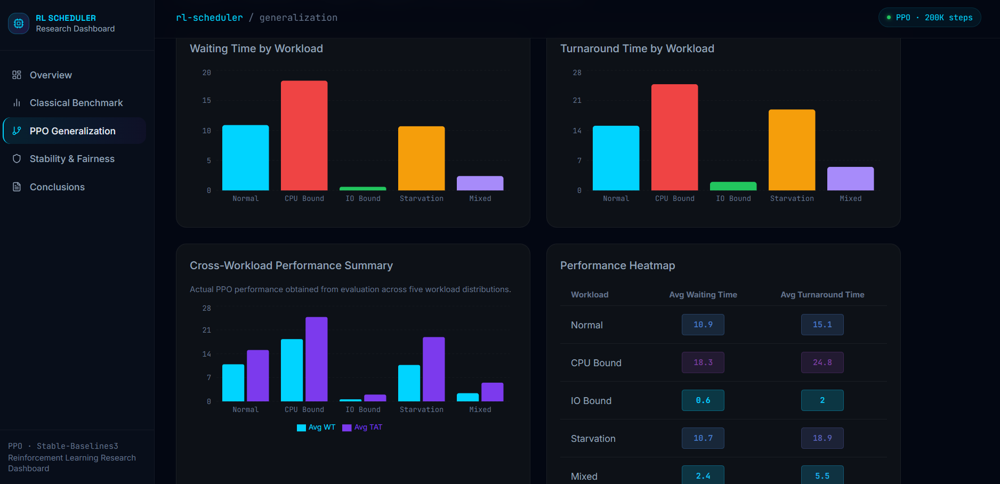
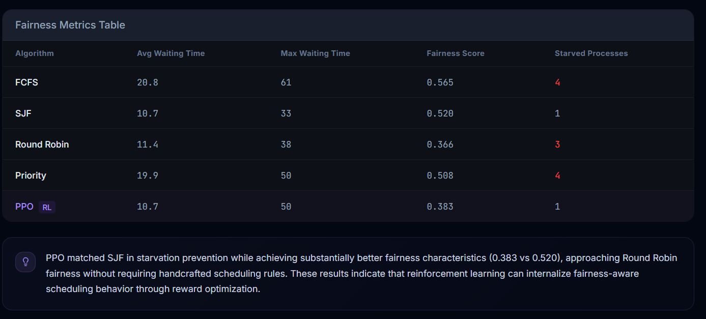

# RL-Based Adaptive CPU Scheduler

A Reinforcement Learning based CPU Scheduling framework that investigates whether Proximal Policy Optimization (PPO) can learn effective CPU scheduling policies through interaction with a simulated operating-system environment.

The project benchmarks PPO against classical scheduling algorithms and evaluates performance across multiple workload distributions, fairness metrics, and multi-seed stability experiments.

---

## Key Features

### Classical Scheduling Algorithms

* FCFS (First Come First Serve)
* SJF (Shortest Job First)
* Round Robin
* Priority Scheduling
* SRTF (Shortest Remaining Time First)

### Reinforcement Learning Schedulers

* PPO-based Non-Preemptive Scheduler
* PPO-based Preemptive Scheduler
* Custom Gymnasium Environments
* Stable-Baselines3 Integration

### Workload Categories

* Normal
* CPU-Bound
* IO-Bound
* Starvation-Oriented
* Mixed

### Evaluation Framework

* Classical Scheduler Benchmarking
* PPO Generalization Analysis
* Multi-Seed Stability Evaluation
* Fairness Analysis
* Starvation Analysis
* Interactive Dashboard Visualization

---

## Tech Stack

* Python
* Gymnasium
* Stable-Baselines3
* PPO
* NumPy
* Matplotlib
* React
* TypeScript
* Recharts

---

## Project Architecture

Workload Generator ->
CPU Scheduling Environment ->
State Representation ->
PPO Agent ->
Training Loop ->
Evaluation Framework ->
Interactive Dashboard ->

---

## Classical Scheduler Benchmark

| Algorithm   | Avg WT | Avg TAT | Throughput | Context Switches |
| ----------- | ------ | ------- | ---------- | ---------------- |
| FCFS        | 14.8   | 19.0    | 0.23       | 9                |
| SJF         | 8.3    | 12.5    | 0.23       | 9                |
| Round Robin | 13.3   | 17.5    | 0.23       | 22               |
| Priority    | 12.7   | 16.9    | 0.23       | 9                |

Key Observation:

SJF achieved the lowest waiting and turnaround times due to access to burst-time information.

---

## PPO Generalization Results

Single PPO policy evaluated across unseen workloads.

| Workload   | Avg WT | Avg TAT |
| ---------- | ------ | ------- |
| Normal     | 10.9   | 15.1    |
| CPU-Bound  | 18.3   | 24.8    |
| IO-Bound   | 0.6    | 2.0     |
| Starvation | 10.7   | 18.9    |
| Mixed      | 2.4    | 5.5     |

Key Observation:

The PPO policy generalized successfully across all workload categories without workload-specific retraining.

---

## Fairness Analysis

| Algorithm   | Avg WT | Max WT | Fairness Score | Starved Processes |
| ----------- | ------ | ------ | -------------- | ----------------- |
| FCFS        | 20.8   | 61     | 0.565          | 4                 |
| SJF         | 10.7   | 33     | 0.520          | 1                 |
| Round Robin | 11.4   | 38     | 0.366          | 3                 |
| Priority    | 19.9   | 50     | 0.508          | 4                 |
| PPO         | 10.7   | 50     | 0.383          | 1                 |

Note:

Lower fairness score indicates lower waiting-time disparity among processes. PPO achieved better fairness than SJF and Priority scheduling while matching SJF in starvation prevention.

---

## Multi-Seed Evaluation

PPO was evaluated across multiple random seeds and workload distributions.

Results showed:

* Consistent behavior across workload types.
* Stable performance under seed variation.
* Strongest performance on IO-Bound and Mixed workloads.
* CPU-Bound workloads remained the most challenging scenario.

---

## Interactive Dashboard

### Overview

### Pipeline

### Classical Benchmark

### PPO Generalization

### Fairness Analysis

---

## Future Work

* Multi-Core CPU Scheduling
* Fairness-Aware Reward Functions
* Real Workload Trace Evaluation
* DQN Scheduler
* A2C Scheduler
* Transformer-Based Scheduling Policies

---

## Author

Vijay B V

